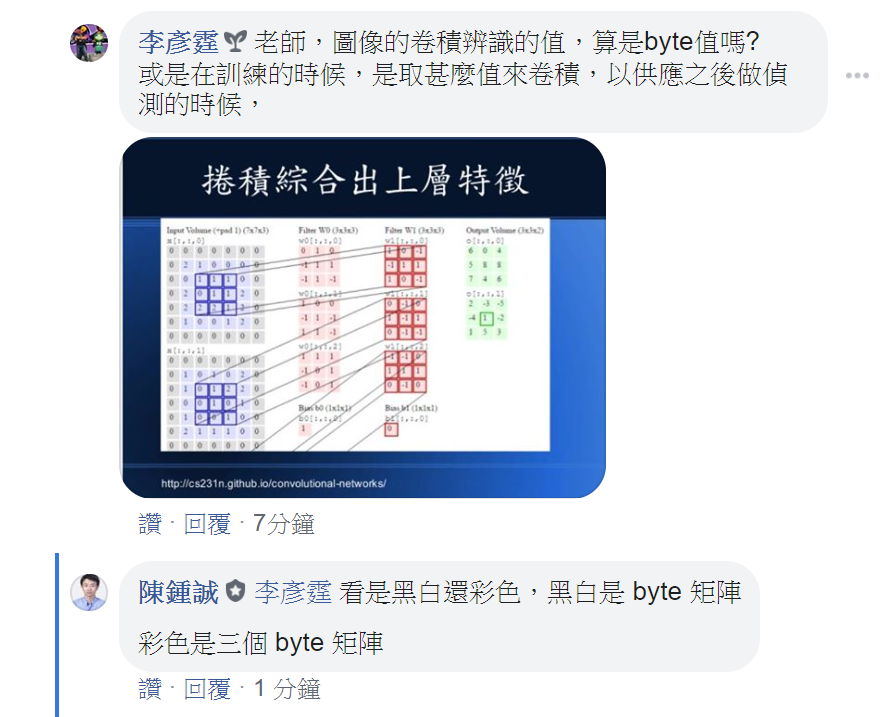
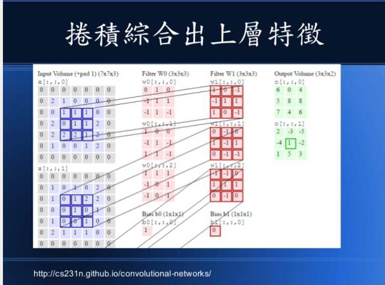

深度學習的捲積神經網路
=

在開始上課時，我認為這個網站非常重要
[Click here](https://www.slideshare.net/ccckmit/javascript-nodejs?fbclid=IwAR217on9iAxTKsq5QtzkujQlqBLJTOPH7eBX8S5o7LjVLp615_TTptYvqpY)。

同時也被我找到了這個，[Click here](https://cs.stanford.edu/people/karpathy/convnetjs/demo/mnist.html)，裡面使用JS立即顯示CNN網格。

經過向老師的詢問，我也了解了卷積的一些資料:
* 當今天圖片是"黑白"時，卷積的值會是二維的byte矩陣，值介於0~250。
*  當今天圖片是"彩色"時，會有"紅"、"綠"、"藍"，三張byte二維陣列。
* 外圈的"0"是為了能夠偵測到最邊邊的特徵，所以將圖片擴充。

詢問時的狀況:



我把圖片放大一下:



# 深度學習的RNN/LSTM循環神經網路

[範例連結](https://www.slideshare.net/ccckmit/rnn-lstm-77568016?fbclid=IwAR3gDG4CIArR_tJ7N7sojLfdJFOkjyzs_61JwfYh6XI91wAWbL0IecM3oUU)

裡面可以看到他使用這類的的技術，實作在好多地方，有興趣可以去看看。

torchvision、torchtext
=
[torchvision解說網站](https://pytorch.org/docs/stable/torchvision/index.html?fbclid=IwAR2YcEoU8Om2YF9r88Dsu5MiKV8sib5V_IF-azBV5-vZe3UIsg3wReK6zdo)

[torchtext解說網站](https://pytorch.org/text/?fbclid=IwAR2jDqVviqaupvfEFuvUPuASNTvXMmFaBtWbl4VnQdAg_1dGCYdfN1zf6-g)

Classify
=

```
# https://www.learnopencv.com/pytorch-for-beginners-image-classification-using-pre-trained-models/
import sys
import torch
from torchvision import models
from torchvision import transforms

# print('models=', dir(models))

model = sys.argv[1]
imgFile = sys.argv[2]

if model == 'alexnet':
    net = models.alexnet(pretrained=True)
elif model == 'resnet18':
    net = models.resnet18(pretrained=True)
else:
    raise Exception('Error', 'model='+model)

transform = transforms.Compose([            #[1]
 transforms.Resize(256),                    #[2]
 transforms.CenterCrop(224),                #[3]
 transforms.ToTensor(),                     #[4]
 transforms.Normalize(                      #[5] RGB 三種顏色的正規化
 mean=[0.485, 0.456, 0.406],                #[6]
 std=[0.229, 0.224, 0.225]                  #[7]
 )])

# Import Pillow
from PIL import Image
img = Image.open(imgFile)
# print('img=', img)

img_t = transform(img)
print('img_t.shape=', img_t.shape)
# print('img_t=', img_t)

batch_t = torch.unsqueeze(img_t, 0)
print('batch_t.shape=', batch_t.shape)
# print('batch_t=', batch_t)

net.eval()

preds = net(batch_t)
print('preds.shape=', preds.shape)
# print('preds=', preds)

with open('imagenet_classes.txt') as f:
    labels = [line.strip() for line in f.readlines()]

pred, class_idx = torch.max(preds, dim=1)
print(labels[class_idx]) # Labrador retriever 代表成功辨識為『拉布拉多拾獵犬』

```

Output:
=

```
mac020:01-classify mac020$ python predict.py resnet18 img/cat.jpg
img_t.shape= torch.Size([3, 224, 224])
batch_t.shape= torch.Size([1, 3, 224, 224])
preds.shape= torch.Size([1, 1000])
lynx, catamount
(env) mac020:01-classify mac020$ python predict.py resnet18 img/parrot.jpg
img_t.shape= torch.Size([3, 224, 224])
batch_t.shape= torch.Size([1, 3, 224, 224])
preds.shape= torch.Size([1, 1000])
lorikeet
(env) mac020:01-classify mac020$ python predict.py resnet18 img/dog.jpg
img_t.shape= torch.Size([3, 224, 224])
batch_t.shape= torch.Size([1, 3, 224, 224])
preds.shape= torch.Size([1, 1000])
Labrador retriever

```
